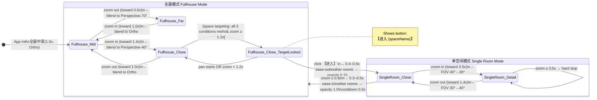

# Camera / View Switching System Design
# 镜头视角切换系统设计文档

> **Status 状态:** Development-Ready Specification 开发就绪规范
> **Target 目标产品:** 3D Home Viewer / 3D 家居展示应用
> **Rendering Engine 渲染引擎:** Three.js (TypeScript)
> **Last Updated 最后更新:** 2026-04-07

---

## Table of Contents 目录

1. [四级镜头参数表 — Four-Level Shot Parameters](#1-四级镜头参数表--four-level-shot-parameters)
2. [完整状态机 — Full State Machine](#2-完整状态机--full-state-machine)
   - 2.1 [全屋模式 Fullhouse Mode](#21-全屋模式-fullhouse-mode)
   - 2.2 [空间定位逻辑 Space Targeting Logic](#22-空间定位逻辑-space-targeting-logic)
   - 2.3 [单空间模式 Single Room Mode](#23-单空间模式-single-room-mode)
   - 2.4 [Mermaid State Diagram](#24-mermaid-state-diagram)
3. [投影过渡方案 — Projection Transition](#3-投影过渡方案--projection-transition)
4. [滞回机制 — Hysteresis](#4-滞回机制--hysteresis)
5. [平移约束 — Pan Constraints](#5-平移约束--pan-constraints)
6. [完整交互事件表 — Interaction Events Checklist](#6-完整交互事件表--interaction-events-checklist)
7. [配置参数 YAML — Configuration YAML](#7-配置参数-yaml--configuration-yaml)
8. [Tech Stack Suggestion for Demo](#8-tech-stack-suggestion-for-demo)
9. [Quick Start for Copilot](#9-quick-start-for-copilot)

---

## 1. 四级镜头参数表 — Four-Level Shot Parameters

| 镜头级别 Shot Level | 距离倍率 Distance Multiplier | FOV / 投影 Projection | 适用场景 Use Case | 模式 Mode |
|---|---|---|---|---|
| 远景 Far | 0.6x（最远 max-out） | 70° 透视 Perspective | 全屋概览 Full-house overview | 全屋 Fullhouse |
| **中景 Mid（默认 Default）** | **1.0x（基准 baseline）** | **轴测 Orthographic（无 FOV）** | **最大地板面积显示全屋 Max floor area** | **全屋 Fullhouse** |
| 近景 Close | 1.4x（拉近 zoom-in） | 40° 透视 Perspective | 单空间视角 Single-room view | 全屋 / 单空间 Both |
| 特写 Detail | 2.0x ~ 3.5x（最近 max-in） | 30° 透视 Perspective | 单件家具 Individual furniture | 仅单空间 Single-room only |

> **⚠️ Important — Mid Shot Projection:**
> The Mid shot uses **Orthographic projection** (no FOV angle applies).
> Transitioning between Mid (ortho) and Far/Close (perspective) requires a **projection blend** (Orthographic ⇄ Perspective).
> This is the most technically challenging part of the system.

---

## 2. 完整状态机 — Full State Machine

### 2.1 全屋模式 Fullhouse Mode

| Parameter | Value |
|---|---|
| 缩放范围 Zoom range | 0.6x (far) ↔ 1.4x (close) |
| 默认缩放 Default zoom | 1.0x |
| 1.0x 时的投影 Projection at 1.0x | Orthographic（轴测） |
| 缩小至 0.6x 时 Zoom out toward 0.6x | Blend to Perspective 70° |
| 放大至 1.4x 时 Zoom in toward 1.4x | Blend to Perspective 40° |
| 1.4x 硬限制 Hard stop at 1.4x | 无法继续放大 Cannot zoom further |
| 显示【进入】按钮条件 Show Enter button | zoom ≥ 1.2x AND space targeting conditions met |

### 2.2 空间定位逻辑 Space Targeting Logic

The **Enter Room** button appears when all three conditions are simultaneously satisfied:

| # | 条件 Condition | 判断方式 Evaluation |
|---|---|---|
| 1 | 屏幕中心射线 Screen-center raycast | 命中某房间地板网格 Hits a room's `floor` mesh |
| 2 | 包围盒覆盖 Bounding box coverage | 该房间包围盒占屏幕面积 ≥ 50% Room bbox covers ≥ 50% of screen |
| 3 | 当前缩放 Current zoom | ≥ 1.2x |

**Button visibility rules 按钮可见性规则:**

- 平移中 During panning → 隐藏 Hide button immediately
- 平移停止后 After pan stops → 等待 0.3s 后重新评估 Wait 0.3 s then re-evaluate all 3 conditions
- 上述三个条件全部成立 All 3 conditions met → 显示 Show `【进入 {spaceName}】`
- 任意一个不成立 Any condition fails → 隐藏 Hide

> **Design decision 设计决策:** Raycast + coverage ratio (conditions 1+2) is chosen over
> "bounding-box-center only" because it handles irregular room shapes and avoids false triggers
> when the camera is panning across room boundaries.

### 2.3 单空间模式 Single Room Mode

| Parameter | Value |
|---|---|
| 触发方式 Trigger | 用户点击【进入】按钮 User clicks the Enter button |
| 起始状态 Starting state | 近景 Close (1.4x / 40°) |
| 缩放范围 Zoom range | 1.4x (close) ↔ 3.5x (detail max) |
| 放大硬限制 Hard stop zoom-in | 3.5x |
| 缩小自动退出阈值 Auto-exit zoom-out threshold | ≤ 0.9x（滞回阈值 hysteresis, NOT 1.0x） |
| 退出后状态 State after exit | 全屋模式 Fullhouse, 中景 Mid (1.0x / ortho) |
| 其他房间 Other rooms | 半透明 opacity 0.15（进入时 on enter）→ 恢复 1.0（退出时 on exit） |

**Transition animations 转场动画:**

| Event | Duration | Easing |
|---|---|---|
| 进入单空间 Enter room | 0.4 ~ 0.6 s | ease-out |
| 退出单空间 Exit room | 0.3 ~ 0.5 s | ease-in |

### 2.4 Mermaid State Diagram



---

## 3. 投影过渡方案 — Projection Transition

### Blend Zone Overview 过渡区间示意

```
Zoom:    0.6x          0.85x     1.0x      1.15x          1.4x
          │              │         │          │              │
          │  Pure 70°    │← blend →│  Pure    │← blend  →   │  Pure 40°
          │  Perspective │ P ⇄ O   │  Ortho   │  O ⇄ P      │  Perspective
          │  (远景 Far)  │         │(中景 Mid)│             │  (近景 Close)
```

- Outside blending zones: pure projection is used (no cost).
- Inside blend zones (0.85–1.0x and 1.0–1.15x): interpolate between Perspective and Orthographic cameras.

### Pseudocode 伪代码

```text
function updateProjection(zoom: float):
    if zoom < 0.85:
        # Pure Far Perspective: FOV varies with zoom
        fov = lerp(70°, 55°, (zoom - 0.6) / (0.85 - 0.6))
        camera = PerspectiveCamera(fov)

    elif zoom < 1.0:
        # Blend zone: Perspective → Orthographic
        blend = (zoom - 0.85) / (1.0 - 0.85)       # 0 at 0.85x, 1 at 1.0x
        fov   = lerp(55°, 0°, blend)                 # FOV collapses toward 0 (ortho)
        camera = lerpCamera(PerspectiveCamera(55°), OrthographicCamera, blend)

    elif zoom == 1.0:
        # Pure Orthographic (axonometric / isometric)
        camera = OrthographicCamera

    elif zoom < 1.15:
        # Blend zone: Orthographic → Perspective
        blend = (zoom - 1.0) / (1.15 - 1.0)         # 0 at 1.0x, 1 at 1.15x
        camera = lerpCamera(OrthographicCamera, PerspectiveCamera(40°), blend)

    else:
        # Pure Close Perspective: FOV varies with zoom
        fov = lerp(40°, 40°, (zoom - 1.15) / (1.4 - 1.15))
        camera = PerspectiveCamera(fov)
```

### Three.js Implementation Notes Three.js 实现注意事项

In Three.js there is no native "blend between two camera types". The recommended approach:

```typescript
// Maintain TWO cameras: one perspective, one orthographic
// Render scene twice (or use MRT) and lerp the output, OR
// Approximate by continuously adjusting the Perspective camera's FOV + near/far
// to visually match an orthographic view at the blend midpoint.

function lerpCameraMatrix(
  perspCam: THREE.PerspectiveCamera,
  orthoCam: THREE.OrthographicCamera,
  t: number // 0 = perspective, 1 = orthographic
): void {
  // Approach: adjust perspective FOV to simulate ortho at t=1
  // At t=1, FOV → near 0 (parallel projection approximation)
  perspCam.fov = THREE.MathUtils.lerp(currentFov, 0.01, t);
  perspCam.updateProjectionMatrix();
  // Note: true orthographic requires switching camera type.
  // Use a shader-based blend or swap cameras at t > 0.95 for best quality.
}
```

---

## 4. 滞回机制 — Hysteresis

Hysteresis prevents rapid mode-toggling (jitter) at zoom boundaries.

| 触发事件 Event | 阈值 Threshold | 机制 Mechanism |
|---|---|---|
| 进入单空间 Enter single room | zoom ≥ 1.4x + 空间定位成立 + 点击按钮 | 用户主动确认点击，无需滞回 User-confirmed, no hysteresis needed |
| 退出单空间 Exit single room | zoom ≤ **0.9x**（非 1.0x） | 需要缓冲区 Buffer zone required |
| 退出后冷却 Post-exit cooldown | 退出后 0.5s After exit | 忽略所有缩放输入 Ignore all zoom input |

```
Single Room zoom-out axis:

  1.4x ──────────────── 1.0x ──── 0.9x ──── 0.6x
                                   ↑
                            EXIT trigger here
                            (NOT at 1.0x)

Buffer zone: 1.0x → 0.9x = 0.1x of "dead zone" before exit fires
```

**Why 0.9x? 为什么选 0.9x?**

- If exit fired exactly at 1.0x, a user near 1.0x who micro-oscillates the zoom would repeatedly enter/exit single room mode.
- The 0.1x dead zone (1.0x → 0.9x) absorbs natural hand-tremor and scroll-wheel over-shoot.

---

## 5. 平移约束 — Pan Constraints

### 全屋模式 Fullhouse Mode

| Parameter | Value |
|---|---|
| 平移范围 Pan range | 地板包围盒 Floor bounding box + **20% padding** |
| 边界类型 Boundary type | **硬边界 Hard** — cannot exceed bounds |
| 平移时 During pan | 立即隐藏【进入】按钮 Immediately hide Enter button |
| 平移停止后 After pan stops | 等待 **0.3 s** 后重新评估空间定位 Re-evaluate space targeting |

```
    ┌─────────────────────────────┐
    │   Floor BBox + 20% padding  │  ← Hard boundary (camera blocked)
    │   ┌─────────────────────┐   │
    │   │   Actual floor mesh │   │
    │   └─────────────────────┘   │
    └─────────────────────────────┘
```

### 单空间模式 Single Room Mode

| Parameter | Value |
|---|---|
| 平移范围 Pan range | 房间包围盒 Room bounding box + **10% padding** |
| 边界类型 Boundary type | **弹性边界 Elastic** (iOS-style bounce) |
| 最大越界 Max overshoot | 边界外 **15%** Up to 15% beyond boundary |
| 反弹阻尼 Bounce damping | **0.8** (spring back on pointer release) |

```
    ┌─────────────────────────────────┐
    │   Room BBox + 10% + 15% extra   │  ← Elastic: can drag here, springs back
    │   ┌─────────────────────────┐   │
    │   │  Room BBox + 10% pad    │   │  ← Natural pan boundary
    │   │  ┌───────────────────┐  │   │
    │   │  │  Actual room mesh │  │   │
    │   │  └───────────────────┘  │   │
    │   └─────────────────────────┘   │
    └─────────────────────────────────┘
```

**Elastic pan pseudocode 弹性平移伪代码:**

```text
on pointerMove(delta):
    newOffset = currentOffset + delta
    if isOutsideBounds(newOffset, roomBbox * 1.10):
        overshoot = newOffset - clamp(newOffset, bounds)
        # Dampen the overshoot (rubber-band effect)
        newOffset = clamp(newOffset, bounds) + overshoot * (1 - DAMPING)  # DAMPING=0.8
    currentOffset = newOffset

on pointerRelease():
    if isOutsideBounds(currentOffset, roomBbox * 1.10):
        # Spring back to nearest boundary
        animateTo(clamp(currentOffset, bounds), duration=0.3s, easing=spring)
```

---

## 6. 完整交互事件表 — Interaction Events Checklist

Priority legend 优先级说明:
- **P0** — Core functionality, must ship 核心功能，必须实现
- **P1** — Important polish, should ship 重要细节，应该实现
- **P2** — Nice to have, can defer 锦上添花，可推迟

| # | 触发条件 Trigger | 系统行为 System Behavior | 优先级 Priority |
|---|---|---|---|
| 1 | 场景初始化 Scene init | 全屋模式 / 中景 / 1.0x / Orthographic / 居中 Centered | **P0** |
| 2 | 全屋模式缩小 Fullhouse zoom out | 1.0x → 0.6x；Ortho → Perspective；FOV → 70° | **P0** |
| 3 | 全屋模式放大 Fullhouse zoom in | 1.0x → 1.4x；Ortho → Perspective；FOV → 40° | **P0** |
| 4 | 全屋模式达到 1.4x Fullhouse hits 1.4x | 硬停止 Hard stop — 阻止继续放大 | **P0** |
| 5 | 全屋 zoom ≥ 1.2x + 空间定位成立 | 显示【进入 {spaceName}】按钮 Show Enter button | **P0** |
| 6 | 全屋模式平移中 Fullhouse panning | 立即隐藏【进入】按钮 Hide Enter button | **P1** |
| 7 | 全屋平移停止 0.3s Fullhouse pan stop 0.3s | 重新评估空间定位三条件 Re-evaluate targeting | **P1** |
| 8 | 点击【进入】按钮 Click Enter button | 0.4~0.6s ease-out 转场 → 进入单空间模式 | **P0** |
| 9 | 进入转场 Enter transition | 其他房间 → opacity 0.15（0.4s ease-out） | **P0** |
| 10 | 单空间放大 Single room zoom in | 1.4x → 3.5x；FOV 40° → 30° | **P0** |
| 11 | 单空间达到 3.5x Single room hits 3.5x | 硬停止 Hard stop — 阻止继续放大 | **P1** |
| 12 | 单空间缩小 ≤ 0.9x Single room zoom ≤ 0.9x | 自动退出 → 全屋模式中景 Auto-exit → Fullhouse Mid | **P0** |
| 13 | 退出转场 Exit transition | 其他房间 → opacity 1.0（0.3s ease-in） | **P0** |
| 14 | 退出冷却 Exit cooldown | 退出后 0.5s 忽略缩放输入 0.5s ignore zoom input | **P1** |
| 15 | 全屋平移边界 Fullhouse pan boundary | 地板 bbox + 20%，硬边界 Hard boundary | **P1** |
| 16 | 单空间平移边界 Single room pan boundary | 房间 bbox + 10%，弹性边界 Elastic，最大越界 15% | **P1** |
| 17 | 投影混合区 Projection blend zone 0.85~1.15x | lerp(Perspective, Ortho)；每帧更新 Per-frame update | **P0** |
| 18 | 调试面板 Debug panel | 运行时调整远景参数/FOV/zoom Runtime adjust params | **P2** |

---

## 7. 配置参数 YAML — Configuration YAML

All magic numbers are centralized here for easy tuning.
所有魔法数字集中在此处，方便调试。

```yaml
camera_system:
  shots:
    far:
      zoom: 0.6
      fov: 70
      projection: perspective
    mid:
      zoom: 1.0
      fov: null          # Orthographic — no FOV concept
      projection: orthographic
    close:
      zoom: 1.4
      fov: 40
      projection: perspective
    detail:
      zoom_min: 2.0
      zoom_max: 3.5
      fov: 30
      projection: perspective

  projection_blend:
    # Zone where perspective blends INTO orthographic (zoom increasing)
    blend_zone_lower: [0.85, 1.0]    # perspective(55°) → ortho
    # Zone where orthographic blends INTO perspective (zoom increasing)
    blend_zone_upper: [1.0, 1.15]    # ortho → perspective(40°)
    # Intermediate FOV at blend zone boundaries
    transition_fov: 55               # FOV at 0.85x (boundary between pure-far and blend)

  zoom_limits:
    fullhouse_mode: [0.6, 1.4]
    singleroom_mode: [0.9, 3.5]      # lower bound = exit hysteresis threshold

  space_targeting:
    raycast_target: floor_mesh
    min_screen_ratio: 0.5            # room bbox must cover ≥ 50% of screen
    min_zoom_to_show_button: 1.2
    button_hide_during_pan: true
    button_recheck_delay: 0.3        # seconds after pan stops before re-evaluating

  mode_transition:
    enter_room:
      trigger: button_click
      animation_duration: [0.4, 0.6] # seconds [min, max]
      other_rooms_opacity: 0.15
      easing: ease-out
    exit_room:
      trigger: zoom_below_threshold
      exit_threshold: 0.9            # hysteresis — NOT 1.0x
      animation_duration: [0.3, 0.5]
      other_rooms_opacity_restore: 1.0
      easing: ease-in
      cooldown: 0.5                  # seconds to ignore zoom input after exit

  pan:
    fullhouse_mode:
      bounds: floor_bounding_box
      padding_ratio: 0.2             # +20% beyond floor bbox
      boundary_type: hard
    singleroom_mode:
      bounds: room_bounding_box
      padding_ratio: 0.1             # +10% beyond room bbox
      boundary_type: elastic
      elastic_overshoot: 0.15        # can drag 15% further beyond soft boundary
      bounce_damping: 0.8            # spring-back damping coefficient (0=no damping, 1=instant snap)
```

---

## 8. Tech Stack Suggestion for Demo

### Recommended Stack 推荐技术栈

| Layer | Choice | Reason |
|---|---|---|
| 3D Rendering | **Three.js r165+** | Web-native, huge ecosystem, excellent TypeScript support |
| Language | **TypeScript** | Type-safe state machine, better Copilot inference |
| Build tool | **Vite** | Fast HMR, zero-config TS support |
| Camera controls base | **OrbitControls** (customized) | Built-in pan/zoom/rotate; override zoom limits & add state logic |
| Debug UI | **lil-gui** (successor to dat.gui) | Lightweight, easy runtime param tweaking |
| State machine | **XState v5** or manual enum | XState gives visual debugger; manual enum is simpler to start |

### Scene Structure for Prototyping 场景结构（原型阶段）

```typescript
// Use simple BoxGeometry rooms for prototyping
// Each room = a Group containing:
//   - floor: Mesh (BoxGeometry, used for raycasting)
//   - walls: Mesh[]
//   - furniture: Mesh[] (placeholder boxes)

interface RoomObject {
  id: string;
  name: string;                    // e.g. "客厅 Living Room"
  group: THREE.Group;
  floorMesh: THREE.Mesh;           // raycast target
  boundingBox: THREE.Box3;         // for screen coverage test & pan bounds
}
```

### Camera Architecture 摄像机架构

```typescript
// Keep BOTH camera types active; swap based on blend state
const perspectiveCamera = new THREE.PerspectiveCamera(55, aspect, 0.1, 1000);
const orthographicCamera = new THREE.OrthographicCamera(
  -width / 2, width / 2, height / 2, -height / 2, 0.1, 1000
);

// CameraController manages which is active and blend interpolation
class CameraController {
  private mode: 'fullhouse' | 'singleroom' = 'fullhouse';
  private zoom: number = 1.0;    // normalized multiplier

  update(zoom: number): void {
    this.zoom = zoom;
    this.updateProjection();
    this.updatePanBounds();
    this.evaluateSpaceTargeting();
  }
}
```

### State Machine Enum 状态机枚举

```typescript
enum CameraMode {
  FULLHOUSE_FAR     = 'fullhouse_far',
  FULLHOUSE_MID     = 'fullhouse_mid',      // default
  FULLHOUSE_CLOSE   = 'fullhouse_close',
  SINGLEROOM_CLOSE  = 'singleroom_close',
  SINGLEROOM_DETAIL = 'singleroom_detail',
}

enum ProjectionState {
  PERSPECTIVE  = 'perspective',
  ORTHOGRAPHIC = 'orthographic',
  BLENDING     = 'blending',               // in transition zone 0.85–1.15x
}
```

### Debug Panel (lil-gui) Setup 调试面板设置

```typescript
import GUI from 'lil-gui';

const gui = new GUI({ title: 'Camera Debug 镜头调试' });
const cameraFolder = gui.addFolder('Shot Params 镜头参数');
cameraFolder.add(config.shots.far, 'zoom', 0.3, 1.0).name('Far Zoom 远景倍率');
cameraFolder.add(config.shots.far, 'fov', 30, 100).name('Far FOV 远景视角');
cameraFolder.add(config.shots.close, 'zoom', 1.0, 2.0).name('Close Zoom 近景倍率');
cameraFolder.add(config.projection_blend, 'transition_fov', 40, 70).name('Blend FOV 过渡视角');
const stateDisplay = gui.addFolder('State 状态');
stateDisplay.add(debugState, 'currentMode').name('Mode 模式').listen();
stateDisplay.add(debugState, 'currentZoom').name('Zoom 缩放').listen();
stateDisplay.add(debugState, 'projectionBlend').name('Proj Blend 投影混合').listen();
```

---

## 9. Quick Start for Copilot

> **Instructions for GitHub Copilot 给 Copilot 的指令:**
> Read this section carefully. Use it to scaffold the demo project described in this document.

### Goal 目标

Scaffold a **Three.js + TypeScript + Vite** demo that implements the camera/view switching system
described in this document. The demo should:

1. Render a simple top-down 3D house layout using `BoxGeometry` rooms (at least 3 rooms).
2. Implement the 4-level zoom system: Far (0.6x/70°) → Mid (1.0x/Ortho) → Close (1.4x/40°) → Detail (3.5x/30°).
3. Implement projection blending between Orthographic and Perspective in the 0.85–1.15x zoom range.
4. Implement Fullhouse mode and Single Room mode with the state machine described above.
5. Show the `【进入 {roomName}】` button when space targeting conditions are met (raycast + bbox coverage + zoom ≥ 1.2x).
6. Implement opacity fade (0.15) for non-active rooms when entering single room mode.
7. Add a `lil-gui` debug panel exposing all parameters from the YAML config.

### File Structure to Generate 生成的文件结构

```
app/
  src/
    config/
      cameraConfig.ts          ← TypeScript mirror of the YAML config
    camera/
      CameraController.ts      ← Main camera logic (zoom, pan, projection blend)
      ProjectionBlender.ts     ← Handles ortho ⇄ perspective interpolation
      SpaceTargeting.ts        ← Raycast + bbox coverage logic
      PanConstraints.ts        ← Hard/elastic boundary logic
    scene/
      HouseScene.ts            ← Three.js scene setup, room meshes
      RoomObject.ts            ← Room data structure (floor mesh, bbox, opacity)
    ui/
      EnterRoomButton.ts       ← HTML overlay button logic
      DebugPanel.ts            ← lil-gui setup
    state/
      CameraModeStateMachine.ts ← State enum + transition logic
    main.ts                    ← Entry point, animation loop
  index.html
  vite.config.ts
  tsconfig.json
```

### Key Implementation Checklist for Copilot Copilot 实现要点清单

When generating code, ensure:

- [ ] `CameraController.update(deltaTime)` is called every animation frame
- [ ] Zoom input (wheel + pinch) is normalized to the `[0.6, 1.4]` range in fullhouse mode and `[0.9, 3.5]` in single room mode
- [ ] Projection blend uses `THREE.MathUtils.lerp` on FOV and camera matrix
- [ ] Space targeting raycast uses `THREE.Raycaster` pointed at screen center (0, 0) in NDC
- [ ] Screen coverage test: project room bbox corners to screen, compute screen-space area ratio
- [ ] Enter/exit animations use `gsap.to()` or a custom lerp with `deltaTime`
- [ ] `lil-gui` debug panel exposes all numeric params from `cameraConfig.ts` with `.listen()` on live state values
- [ ] Pan bounds check runs in `CameraController.update()` after applying pan delta
- [ ] Hysteresis exit threshold is `0.9x`, not `1.0x`
- [ ] Post-exit cooldown timer blocks zoom input for `0.5s`

### Copilot Prompt to Start 启动 Copilot 的 Prompt

Paste the following into GitHub Copilot Chat to begin:

```
Based on the design document at docs/camera-system-design.md, scaffold the Three.js + TypeScript
demo. Start with:
1. app/src/config/cameraConfig.ts — TypeScript config object mirroring the YAML in section 7
2. app/src/state/CameraModeStateMachine.ts — state enum + transition guards
3. app/src/camera/CameraController.ts — skeleton class with update(), handleZoom(), handlePan()
Follow all constraints in the design document. Use lil-gui for the debug panel.
```

---

*End of document / 文档结束*
